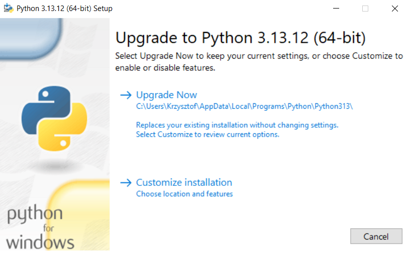
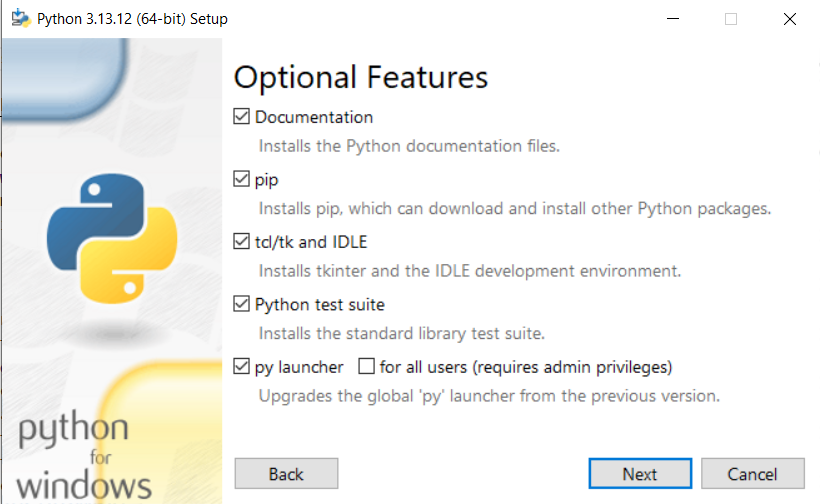
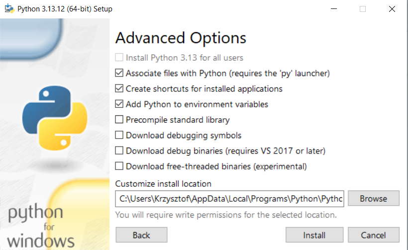
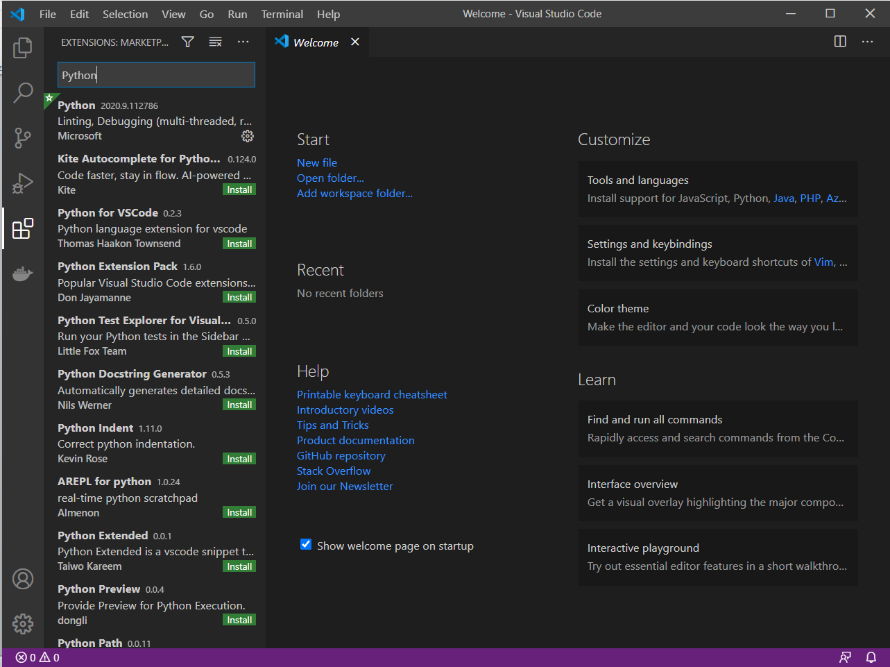

# Moduł 0 - przygotowanie środowiska pracy

## 1. Niezbędne oprogramowanie

### 1.1 IDE - zintegrowane środowisko developerskie

Najbardziej popularnym rozwiązaniem do pracy z językiem Python jest obecnie oprogramowanie **PyCharm IDE od firmy JetBrains**. Dostępne jest w dwóch wariantach:
* **PyCharm Community** - rozwiązanie darmowe.
* **PyCharm Professional** - rozwiązanie płatne (dostępne również w ramach licencji akademickiej, przedłużanej co rok, bez zastosowań komercyjnych).

Różnice między obiema wersjami można znaleźć tu: https://www.jetbrains.com/products/compare/?product=pycharm-ce&product=pycharm

Innym bardzo popularnym rozwiązaniem jest **Visual Studio Code** (w skrócie VSC) firmy Microsoft, które jest narzędziem w pełni darmowym. Jest to uniwersalne narzędzie pozwalające na rozbudowywanie jego możliwości poprzez szereg pluginów. Jednym z najbardziej popularnych jest ten umożliwiający pracę z językiem Python.

### 1.2 Interpreter języka Python

Narzędzie do wspierania procesu wytwarzania oprogramowania (IDE) jest niezwykle pomocne i podnosi produktywność, ale interpreter języka Python będzie nam niezbędny, aby uruchomić nawet najprostszy kod.
Interpreter pobieramy z oficjalnej strony: https://www.python.org/ z sekcji `Downloads`. W trakcie zajęć wykorzystywana będzie **wersja 3.11** najbardziej popularnej implementacji, czyli **CPython (implementacja w języku C)**.

Proces instalacji i konfiguracji zostanie przedstawiony w trakcie szkolenia.

### 1.3 Instalacja oprogramowania

Jako, że Visual Studio Code jest bardzo popularnym narzędziem do pracy z wieloma różnymi technologiami (np. C++, C#, mardown, Latex, Python i inne) jego konfiguracja na potrzeby pracy z językiem Python zostanie również przedstawiona.

**Krok 1** – pobieramy i instalujemy Visual Studio Code ze strony https://code.visualstudio.com/. W zależności od platformy (Windows, macOS, Linux) wybieramy odpowiednią paczkę*.

\* proces instalacji na innych niż Windows platformach będzie się nieco różnił.

**Krok 2** – instalacja interpretera języka Python. 
Na stronie https://www.python.org/ przechodzimy do podstrony Downloads i odnajdujemy wersję 3.10.10. (https://www.python.org/downloads/release/python-3116/). Następnie w części **Files** (na dole strony) odnajdujemy paczkę dla naszego systemu operacyjnego. Jeżeli nie jesteśmy pewni czy dysponujemy wersją 32 czy 64-bitową systemu operacyjnego, można to sprawdzić wybierając z menu kontekstowego (prawy przycisk myszy) opcję 'Właściwości' na ikonie Ten komputer (lub Mój komputer) w przypadku systemu Windows. Dla wersji 64-bit właściwą paczką dla systemu Windows będzie `Windows x86-64 executable installer`, a dla 32-bitowej `Windows x86 executable installer`.
Uruchomienie pobranego pliku skutkuje pojawieniem się okna podobnego do poniższego.

 
Jeżeli jest to jedyny interpreter języka Python w naszym systemie, możemy dodać interpreter do ścieżki systemowej (zmienna środowiskowa **PATH**). Spowoduje to możliwość korzystania z interpretera nie tylko bezpośrednio z folderu, do którego został zainstalowany. Zaznaczamy więc checkbox _**„Add Python to environment variables”**_. Jest to opcja zalecana. 

W przypadku gdy w naszym systemie jest już zainstalowany interpreter Pythona w tej głównej wersji (czyli 3.11.* gdzie * oznacza dowolną liczbę) i instalator to wykryje, pojawi się opcja o nazwie `Upgrade Now` jak na poniższym zrzucie ekranu. **Wybranie jej nadpisze tę wersję interpretera, co może mieć negatywne skutki dla działania projektów, które zostały na tej wersji budowane**.

Jeżeli chcemy zainstalować interpreter w domyślnej zaproponowanej lokalizacji, wybieramy opcję **„Install Now”**. Jeżeli chcemy wybrać inną ścieżkę i zobaczyć dodatkowe opcje wybieramy **„Customize installation”**. Poniżej podgląd okna z wyborem opcji do zainstalowania.

Wybranie **„Next”** wyświetli poniższe okno, gdzie możemy wybrać inną ścieżkę instalacji.

Wybranie opcji **pip** zainstaluje menadżera pakietów Pythona, którym możemy doinstalować w wygodny sposób pakiety, które nie wchodzą w skład biblioteki standardowej. Opcja **tcl/tk and IDLE** nie jest de facto niezbędna na naszych zajęciach, ale okazuje się, że niektóre pakiety pobierane z publicznego repozytorium wymagają pakietu tcl, a jego ręczna instalacja bywa kłopotliwa. IDLE jest prostym oprogramowaniem typu IDE do uruchamiania kodu Pythona w sposób interaktywny lub poprzez skrypty. **Python test suite** instaluje pakiety niezbędne do pisania testów i nie będzie nam w tym kursie potrzebny, ale może przydać się w dalszej przygodzie z nauką języka. Nowsze wersje interpretera Pythona 3 dostarczają narzędzie **py launczer**, które pozwala na uruchamianie różnych wersji interpretera, jeżeli są zainstalowane. Dotyczy systemu Windows. Więcej informacji można znaleźć w oficjalnej dokumentacji pod linkiem: https://docs.python.org/3/using/windows.html

**Krok 3** – Instalacja plug-inu.
Uruchamiamy Visual Studio Code (przykładowe okno poniżej) i wybieramy po lewej stronie ikonę _**Extensions**_. 

 
 
Wyszukujemy frazę „Python” i na odpowiednim elemencie z listy wybieramy _**Install**_ (na screenie poniżej plug-in jest już zainstalowany).
 

To już prawie wszystko, aby móc pracować z językiem Python z wykorzystaniem Visual Studio Code. Szczegóły i dodatkowe możliwości narzędzia zostaną zaprezentowane podczas zajęć.

Aby poprawiać produktywność warto przyswajać sukcesywnie skróty klawiaturowe.
Skróty dla VSC w zwięzłej formie można znaleźć pod adresem: https://code.visualstudio.com/shortcuts/keyboard-shortcuts-windows.pdf

A dla oprogramowania PyCharm tutaj: https://resources.jetbrains.com/storage/products/pycharm/docs/PyCharm_ReferenceCard.pdf